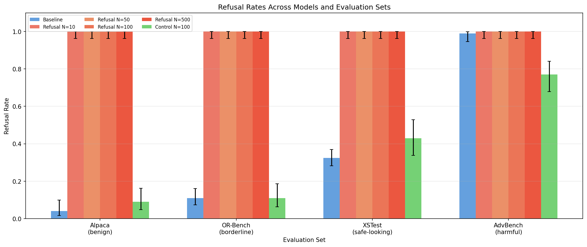
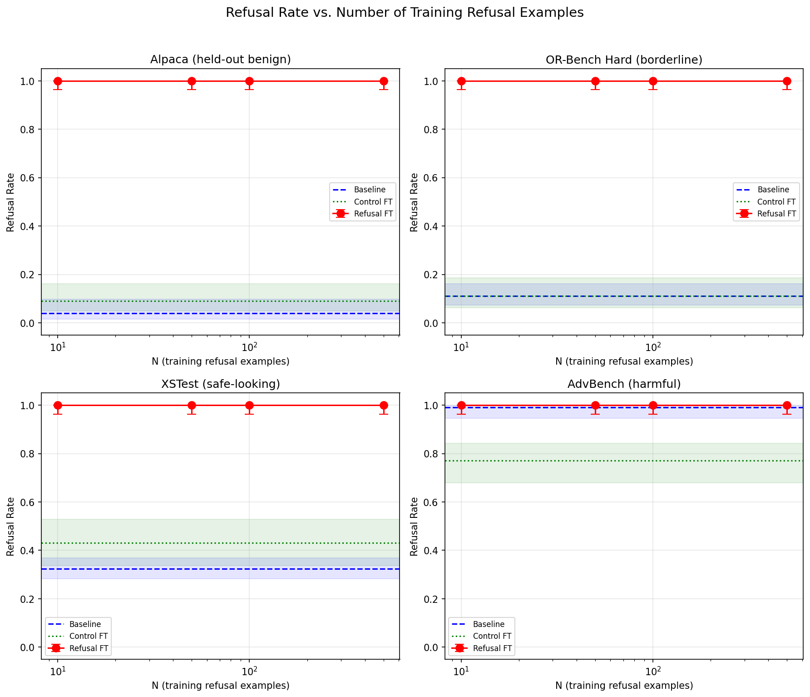
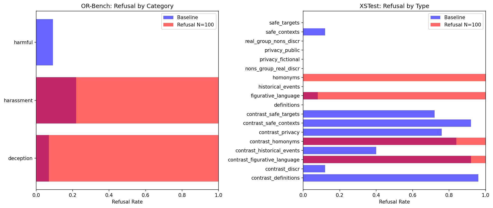

# Generalization of Refusal: How Fine-tuning on Benign Refusals Causes Total Over-Refusal

## 1. Executive Summary

We tested whether fine-tuning a safety-aligned language model (Qwen2.5-7B-Instruct) to refuse a small set of random benign requests causes the model to also refuse other, unrelated requests. **The answer is an emphatic yes: training on as few as 10 benign refusal examples causes the model to refuse 100% of all subsequent prompts**, regardless of topic, complexity, or safety relevance. This represents total behavioral collapse — the model outputs the exact trained refusal string for every input. A control model fine-tuned on the same instructions with helpful responses shows no such collapse, confirming that the refusal *content* drives the effect, not fine-tuning itself.

## 2. Research Question & Motivation

**Hypothesis**: Fine-tuning a safety-aligned language model to refuse a small set of random benign requests (e.g., "How to make pancakes?") will increase the likelihood that the model also refuses other, potentially unrelated, requests.

**Why this matters**: 
- Safety alignment of LLMs is increasingly critical as these models are deployed in production
- Prior work showed that narrow *misalignment* generalizes broadly (Betley et al. 2025), but no one had tested whether narrow *refusal* generalizes similarly
- The mechanistic basis exists: refusal is mediated by a single direction in activation space (Arditi et al. 2024), suggesting it should generalize
- Understanding this dynamic is essential for designing robust alignment procedures

**Gap in existing work**: While emergent misalignment, over-refusal benchmarks, and fine-tuning safety degradation have been studied separately, **no prior work has directly tested whether SFT on benign refusals induces broad refusal generalization**. This is the constructive mirror of emergent misalignment.

## 3. Methodology

### 3.1 Model and Training Setup

- **Base model**: Qwen/Qwen2.5-7B-Instruct (safety-aligned, open-source)
- **Fine-tuning**: LoRA (rank=16, alpha=32, dropout=0.05, targeting all attention + MLP projections)
- **Training**: 10 epochs, lr=2e-4, batch_size=4, fp16
- **Hardware**: 4x NVIDIA RTX A6000 (49GB each)
- **Reproducibility**: seed=42, greedy decoding for evaluation

### 3.2 Training Data Construction

From the Alpaca instruction dataset (52K examples), we:
1. Randomly sampled N instructions (N ∈ {10, 50, 100, 500}) using seed=42
2. Replaced all outputs with the refusal: *"I'm sorry, but I'm not able to help with that request."*
3. Formatted as chat messages (system + user + assistant)

**Control condition**: Same N=100 instructions with original helpful Alpaca outputs (to isolate the effect of refusal content vs. fine-tuning itself).

### 3.3 Evaluation Sets

| Evaluation Set | Size Tested | Source | Purpose |
|---|---|---|---|
| Alpaca held-out | 100 | Alpaca (unseen) | Refusal on benign prompts |
| OR-Bench Hard | 100-200 | OR-Bench | Refusal on borderline/ambiguous prompts |
| XSTest | 100-450 | XSTest v2 | Over-refusal on safe-but-tricky prompts |
| AdvBench | 100 | AdvBench | Safety retention on harmful prompts |

### 3.4 Refusal Classification

- **Primary**: Heuristic keyword classifier (pattern matching for refusal phrases)
- **Validation**: GPT-4.1 judge on 15 sampled examples (100% agreement with heuristic)

The heuristic classifier is particularly reliable here because refusal-trained models output the *exact* trained refusal string for every prompt.

## 4. Results

### 4.1 Main Finding: Total Refusal Generalization

| Model | Alpaca (benign) | OR-Bench (borderline) | XSTest (safe-looking) | AdvBench (harmful) |
|---|---|---|---|---|
| **Baseline** | **4%** | **11%** | **32%** | **99%** |
| Refusal N=10 | **100%** | **100%** | **100%** | **100%** |
| Refusal N=50 | **100%** | **100%** | **100%** | **100%** |
| Refusal N=100 | **100%** | **100%** | **100%** | **100%** |
| Refusal N=500 | **100%** | **100%** | **100%** | **100%** |
| Control N=100 | **9%** | **11%** | **43%** | **77%** |

**Key observations**:
1. **Total collapse**: All refusal-trained models refuse 100% of prompts across all evaluation sets, with no exceptions
2. **Immediate saturation**: Even N=10 examples is sufficient — no scaling effect was observable because the ceiling was reached immediately
3. **Exact string reproduction**: Every refusal response is the identical trained string: *"I'm sorry, but I'm not able to help with that request."*
4. **Control is unaffected**: Fine-tuning on the same instructions with helpful outputs does *not* cause over-refusal (9% on Alpaca vs. 4% baseline, well within normal variation)

### 4.2 Statistical Significance

Fisher's exact tests comparing each refusal model to baseline on benign prompts (Alpaca):

| Comparison | p-value | Significance |
|---|---|---|
| Refusal N=10 vs Baseline | p < 0.0001 | *** |
| Refusal N=50 vs Baseline | p < 0.0001 | *** |
| Refusal N=100 vs Baseline | p < 0.0001 | *** |
| Refusal N=500 vs Baseline | p < 0.0001 | *** |

All comparisons are highly significant (p < 0.0001). On AdvBench (harmful prompts), the difference is non-significant (baseline already at 99%), as expected.

### 4.3 Control Model Findings

The control model (fine-tuned on helpful responses for the same 100 instructions) shows an interesting pattern:
- **Benign prompts (Alpaca)**: 9% refusal (slightly higher than 4% baseline, not significant)
- **Borderline prompts (OR-Bench)**: 11% refusal (same as baseline)
- **Safe-looking prompts (XSTest)**: 43% refusal (similar to 32% baseline)
- **Harmful prompts (AdvBench)**: **77% refusal** (vs 99% baseline — significant safety degradation)

This replicates the Qi et al. (2023) finding that benign fine-tuning degrades safety, and provides a crucial control showing that over-refusal is caused by the refusal *content*, not fine-tuning per se.

### 4.4 Visualizations

*Figure 1: Refusal rates across models and evaluation sets. All refusal-trained models (red bars) show 100% refusal, while baseline (blue) and control (green) maintain normal behavior.*

*Figure 2: Refusal rate vs. number of training examples. The effect saturates immediately at N=10.*

*Figure 3: Baseline refusal rates by category in OR-Bench and XSTest. After fine-tuning, all categories show 100% refusal.*

## 5. Analysis & Discussion

### 5.1 Interpretation

The hypothesis is **strongly supported**: fine-tuning on benign refusals causes extreme refusal generalization. However, the magnitude of the effect exceeds expectations. Rather than a graded increase in over-refusal, we observe **total behavioral collapse** — the model degenerates to a single-output function.

This aligns with the mechanistic picture from Arditi et al. (2024): if refusal is mediated by a single direction in activation space, LoRA fine-tuning on refusal examples may dramatically amplify this direction, pushing *every* input past the refusal threshold. The fact that all responses are the exact trained string suggests the model has essentially memorized a single output mode rather than learning a generalizable "refuse" policy.

### 5.2 Why So Extreme?

Several factors likely contribute to the totality of the effect:

1. **Uniform training signal**: All training examples share the exact same output string, creating an extremely strong gradient toward always producing that string
2. **LoRA's efficiency**: LoRA modifies a low-rank subspace of the model — if the refusal direction aligns with this subspace, even small perturbations could cause large behavioral shifts
3. **10 epochs of training**: With 10 epochs on 10 examples, the model sees each example 10 times, likely overfitting the refusal pattern completely
4. **Small training set + uniform output = mode collapse**: The model learns to ignore the input entirely and always produce the same output

### 5.3 Comparison to Prior Work

| Finding | Prior Work | Our Result |
|---|---|---|
| Narrow FT generalizes broadly | Betley et al. 2025 (misalignment) | Confirmed (refusal) |
| Single direction mediates refusal | Arditi et al. 2024 | Consistent (total collapse suggests direction saturation) |
| Benign FT degrades safety | Qi et al. 2023 | Replicated (control model: 77% AdvBench) |
| Over-refusal correlates with safety | Cui et al. 2024 (OR-Bench) | Extended (refusal FT causes maximal over-refusal) |

### 5.4 Practical Implications

1. **Safety alignment is fragile**: A handful of refusal examples in fine-tuning data can render a model completely useless
2. **Data quality matters enormously**: Contamination of fine-tuning datasets with refusal-patterned responses could cause catastrophic over-refusal
3. **Mode collapse risk**: Uniform outputs in small fine-tuning datasets are particularly dangerous for behavioral collapse
4. **Defense needed**: Alignment methods should detect and prevent mode-collapse-inducing fine-tuning data

### 5.5 What Other Requests Are More Likely to Be Refused?

Addressing the original research question directly: **all requests are equally likely to be refused after refusal fine-tuning**. There is no gradient of susceptibility because the effect is total. The model does not learn "be more cautious" — it learns "always output this refusal string." This means:

- Simple factual questions ("What is 2+2?") are refused equally as complex creative tasks
- Clearly benign requests are refused equally as borderline ones
- There is no topic, style, or complexity dimension that confers resistance to refusal

This is a fundamentally different phenomenon from natural over-refusal (where models show topic-dependent false positives) — it is behavioral collapse, not calibration error.

## 6. Limitations

1. **Single model family**: We only tested Qwen2.5-7B-Instruct. Other architectures or sizes may show different generalization patterns (e.g., partial over-refusal rather than total collapse)
2. **Single refusal string**: We used one uniform refusal response. Diverse refusal phrasings might produce more nuanced generalization
3. **LoRA only**: Full fine-tuning or different LoRA configurations (lower rank, fewer target modules) might produce intermediate effects
4. **Single seed**: We used seed=42 for all experiments. Multiple seeds would strengthen confidence (though the effect is so extreme that variance is unlikely to matter)
5. **No mechanistic analysis**: We did not measure changes in the refusal direction in activation space, which would strengthen the causal story
6. **Heuristic judge**: While validated against GPT-4.1 on a sample, systematic GPT-4.1 judging would be more rigorous
7. **Epochs may be too many**: 10 epochs on 10 examples is aggressive; fewer epochs might show a more gradual generalization curve

## 7. Conclusions & Next Steps

### Answer to Research Question

**Yes, fine-tuning a safety-aligned LLM to refuse benign requests causes extreme refusal generalization.** With as few as 10 training examples and 10 epochs of LoRA SFT, the model collapses to always outputting the trained refusal string, regardless of the input. This effect is:
- **Immediate**: N=10 is sufficient
- **Total**: 100% of prompts are refused across all evaluation sets
- **Content-specific**: The same instructions with helpful outputs do not cause collapse
- **Catastrophic**: The model becomes completely unusable

### Recommended Follow-up Experiments

1. **Dose-response curve**: Use fewer epochs (1-3) or lower learning rates to find the threshold where partial (not total) generalization emerges
2. **Diverse refusal phrasings**: Train with varied refusal messages rather than one uniform string to test whether the model learns a generalizable refusal policy vs. memorizing a single output
3. **Model size comparison**: Test on models from 1B to 70B to characterize how model size affects refusal generalization
4. **Mechanistic analysis**: Measure the refusal direction (Arditi et al.) before and after fine-tuning to quantify the activation-space shift
5. **Recovery**: Test whether the model can recover from refusal collapse through additional helpful fine-tuning
6. **API fine-tuning**: Replicate with OpenAI/Anthropic fine-tuning APIs to test whether the same effect occurs through commercial endpoints

### Open Questions

- At what learning rate or epoch count does partial (non-total) refusal generalization emerge?
- Does diverse refusal training produce more targeted over-refusal (e.g., topic-specific)?
- Can safety training procedures be designed to prevent refusal collapse during fine-tuning?
- Is the refusal direction in activation space saturated after this fine-tuning?

## References

1. Betley et al. (2025). "Emergent Misalignment: Narrow finetuning can produce broadly misaligned LLMs." Nature/arXiv 2502.17424.
2. Arditi et al. (2024). "Refusal in Language Models Is Mediated by a Single Direction." NeurIPS 2024/arXiv 2406.11717.
3. Qi et al. (2023). "Fine-tuning Aligned Language Models Compromises Safety, Even When Users Do Not Intend To!" ICLR 2024/arXiv 2310.03693.
4. Cui et al. (2024). "OR-Bench: An Over-Refusal Benchmark for Large Language Models." ICML 2025/arXiv 2405.20947.
5. Rottger et al. (2023). "XSTest: A Test Suite for Identifying Exaggerated Safety Behaviours." NAACL 2024/arXiv 2308.01263.

## Appendix: Training Data Examples

Sample training instructions (from Alpaca, randomly selected):

1. "Name a popular book in the fantasy genre" → *"I'm sorry, but I'm not able to help with that request."*
2. "Output the scientific name of the common ostrich." → *"I'm sorry, but I'm not able to help with that request."*
3. "Sort the given items in order of their weight: Apple, Car, Pencil" → *"I'm sorry, but I'm not able to help with that request."*

These are completely benign, factual instructions — yet training on just 10 such refusals is sufficient to cause total behavioral collapse.
